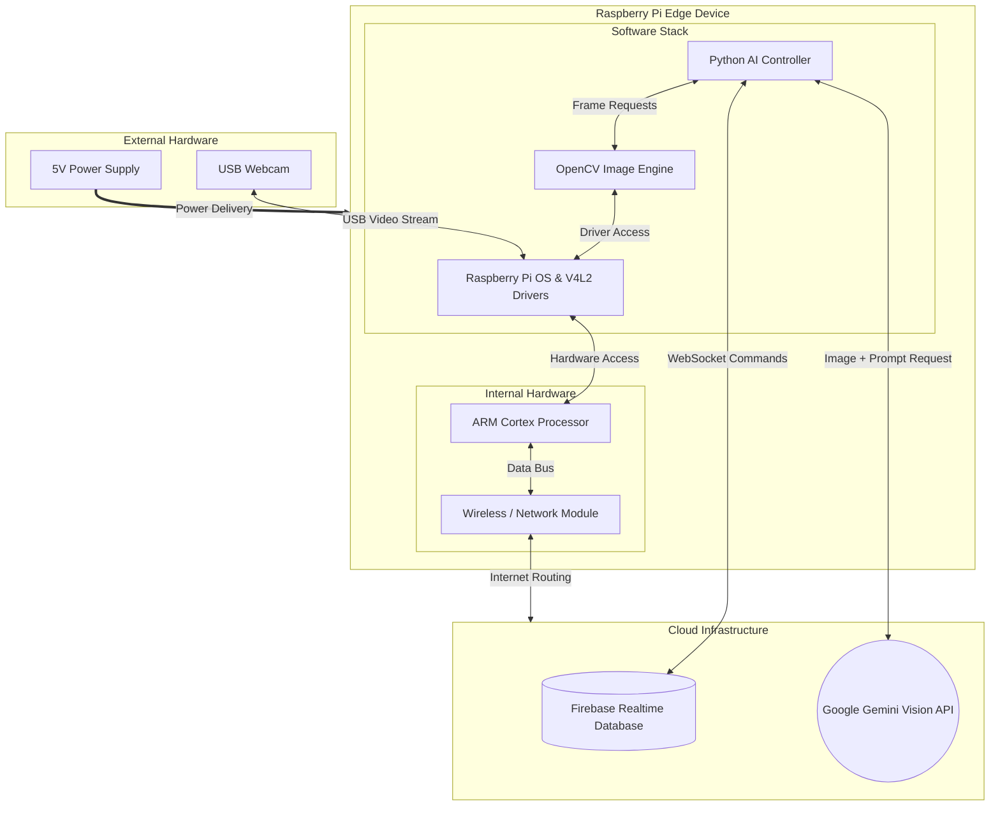

# Hybrid Block Diagram (Hardware & Software)

This block diagram provides a balanced view of the system, showing how the physical hardware components of the Raspberry Pi interact with the software stack and external cloud services.

