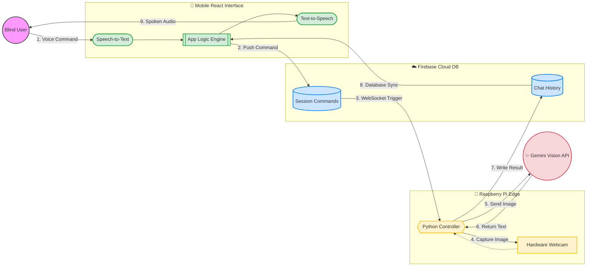

# Samaksh System Architecture

This diagram illustrates the high-level architecture of the Samaksh Blind Assistance System. It follows a clean, numbered sequence (1 to 9) showing exactly how data travels through the system and back to the user.

